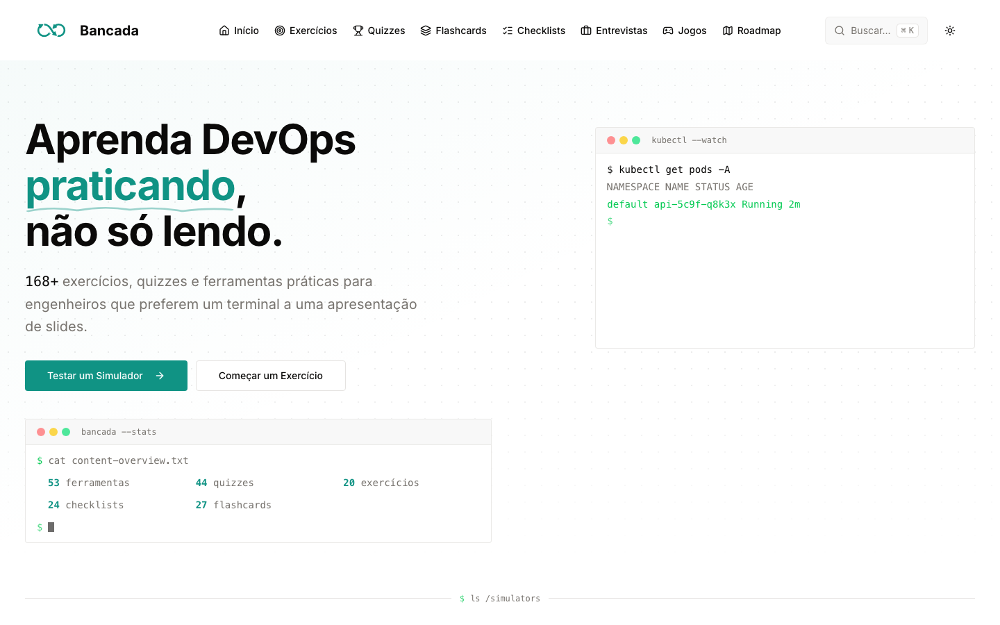

# Bancada

<p align="center">
  <strong>Aprenda DevOps praticando, não só lendo.</strong>
</p>

<p align="center">
  Uma plataforma open source em português com simuladores, exercícios e ferramentas interativas para estudar DevOps e system design.
</p>

<p align="center">
  <a href="https://bancada-9g8r.vercel.app/"><strong>Acessar a demonstração</strong></a>
  ·
  <a href="https://github.com/victrhugo/bancada/issues">Reportar um problema</a>
  ·
  <a href="CONTRIBUTING.md">Contribuir</a>
</p>

<p align="center">
  <a href="https://github.com/victrhugo/bancada/releases"></a>
  <a href="https://github.com/victrhugo/bancada/actions/workflows/tests.yml"></a>
  <a href="https://github.com/victrhugo/bancada/actions/workflows/build.yml"></a>
  <a href="LICENSE"></a>
</p>

[](https://bancada-9g8r.vercel.app/)

## O que você encontra

O Bancada reúne **168 recursos práticos**, acessíveis gratuitamente e sem exigir cadastro:

- **53 jogos e simuladores** de DevOps e system design;
- **20 exercícios práticos** guiados;
- **44 quizzes** para testar conhecimentos;
- **27 conjuntos de flashcards** para revisão;
- **24 checklists** para cenários reais;
- roadmaps e perguntas de entrevista organizados por nível;
- terminais educacionais de Linux, Docker, Kubernetes, SQL, MongoDB e PostgreSQL;
- suporte a PWA para instalar e usar como aplicativo.

Explore [simuladores](https://bancada-9g8r.vercel.app/games), [exercícios](https://bancada-9g8r.vercel.app/exercises), [quizzes](https://bancada-9g8r.vercel.app/quizzes), [flashcards](https://bancada-9g8r.vercel.app/flashcards), [checklists](https://bancada-9g8r.vercel.app/checklists) e [roadmaps](https://bancada-9g8r.vercel.app/roadmap).

## Por que o Bancada?

Boa parte do conteúdo sobre infraestrutura explica conceitos sem permitir experimentá-los. O Bancada transforma esses conceitos em experiências interativas, em português, que podem ser usadas diretamente no navegador. O objetivo é reduzir a distância entre estudar uma tecnologia e desenvolver intuição para aplicá-la.

## Como contribuir

Contribuições de código, conteúdo, revisão e acessibilidade são bem-vindas. Para começar:

1. Leia o [guia de contribuição](CONTRIBUTING.md).
2. Escolha uma issue marcada como [`good first issue`](https://github.com/victrhugo/bancada/issues?q=is%3Aissue%20is%3Aopen%20label%3A%22good%20first%20issue%22).
3. Comente na issue para alinhar a proposta antes de implementar.
4. Abra um pull request seguindo os critérios de aceite da issue.

Se encontrar um problema ou tiver uma ideia, [abra uma issue](https://github.com/victrhugo/bancada/issues/new/choose).

## Desenvolvimento local

Requisitos:

- Node.js 22
- pnpm 10

Instale as dependências e inicie o servidor:

```bash
pnpm install
pnpm dev
```

Acesse [http://localhost:3000](http://localhost:3000).

## Validação

```bash
pnpm check-format
pnpm lint
pnpm typecheck
pnpm test
pnpm test:e2e
pnpm build
```

## Governança e suporte

- Consulte o [changelog](CHANGELOG.md) para acompanhar as versões.
- Leia o [guia de contribuição](CONTRIBUTING.md) antes de propor mudanças.
- Siga o [Código de Conduta](CODE_OF_CONDUCT.md) ao participar da comunidade.
- Relate vulnerabilidades conforme a [política de segurança](SECURITY.md).

## Licença

As contribuições próprias do Bancada são distribuídas sob a [Licença Apache 2.0](LICENSE). O projeto foi adaptado de [The DevOps Daily](https://github.com/The-DevOps-Daily/devops-daily), originalmente licenciado sob MIT. Consulte os [avisos de terceiros](THIRD_PARTY_NOTICES.md) para detalhes e atribuições.
